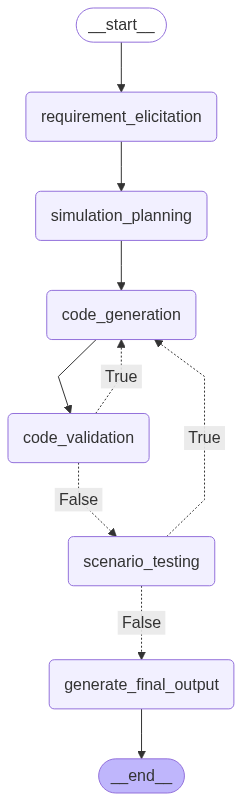

# Autosim: LLM based multi-agent SimPy simulation generator

This project is an AI-powered system that automatically generates SimPy simulation models for production systems through conversation. It uses LangGraph to orchestrate a multi-agent workflow that elicits requirements, generates a simulation plan, implements the code, validates it, and tests it.

## Features

- Interactive requirements elicitation
- Automatic simulation planning
- SimPy code generation
- Code validation with static analysis
- Simulation testing and metrics analysis

## Workflow
This project implements an iterative workflow with loops using LangGraph.
The diagram below shows the complete workflow with all nodes and connections.




## Project Structure
Main:
- `app.py`: Main application and user interface
- `models.py`: Data models and state definitions
- `agents.py`: LLM integration
- `nodes.py`: Workflow node implementations
- `workflow.py`: LangGraph workflow definition
- `prompts.py`: Agent system prompts

Utility:
- `usage_tracker.py`: Tracks cost for LLM API usage
- `visualize_workflow.py`: Generates visualization (.mmd and .png) of LangGraph workflow


## Requirements

Main requirements are:
- Python 3.12
- SimPy 4.1
- Anthropic API key (for Claude model)

Check `requirements.txt` for all further requirements.

## Installation

0. Recommended: Create a virtual environment (conda or venv) with Python 3.12.
1. Clone this repository
2. Install the required packages in your virtual environment:
   ```
   pip install -r requirements.txt
   ```
3. Create a "`.env`" file (dotenv file) in the project's main directory with your Anthropic API key:
   ```
   ANTHROPIC_API_KEY=your-api-key-here
   ANTHROPIC_MODEL=claude-sonnet-4-6
   ```

## Usage

Run the application:

```
python app.py
```
Run the application either directly from terminal, from inside VS Code or your favourite code editor/IDE with access to the terminal. Jupyter isn't recommended as you'll need access to the terminal in order to communicate with the "Requirements Elicitation Agent".

The system will guide you through:
1. Describing your production system
2. Reviewing and confirming requirements

The system will ask you more questions if needed in order to collect all necessary information before presenting a summary for you to confirm or further adjust.

Then it will automatically:
1. Generate a simulation plan
2. Implement SimPy code for the simulation model
3. Validate and test the simulation
4. Analyze the simulation results
5. Save the final SimPy model code to a file


## Example

Here's a short example on how to begin a description for a simple production line:

```
Autosim agent output:
Please describe your production system including:
- Processing steps and sequence
- Machines and their counts
- Storage areas and capacities
- Key metrics you want to track

Your input:
My system has three workstations in sequence. Parts arrive every 5-10 minutes. Workstation 1 takes 3-7 minutes per part, workstation 2 takes exactly 5 minutes, and workstation 3 takes 4-10 minutes. Each workstation can only process one part at a time. I want to track utilization, throughput, and waiting times.
```


## Citation
If you find this repo useful in your research, please consider citing it:

```
@misc{Autosim_Repo,
    author = {Roman Krämer},
    title = {Autosim: LLM based multi-agent SimPy simulation generator},
    howpublished = {\url{https://github.com/romankraemer/ASIM2025}},
    year = {2025},
    note = {Accessed: \today}
}
```